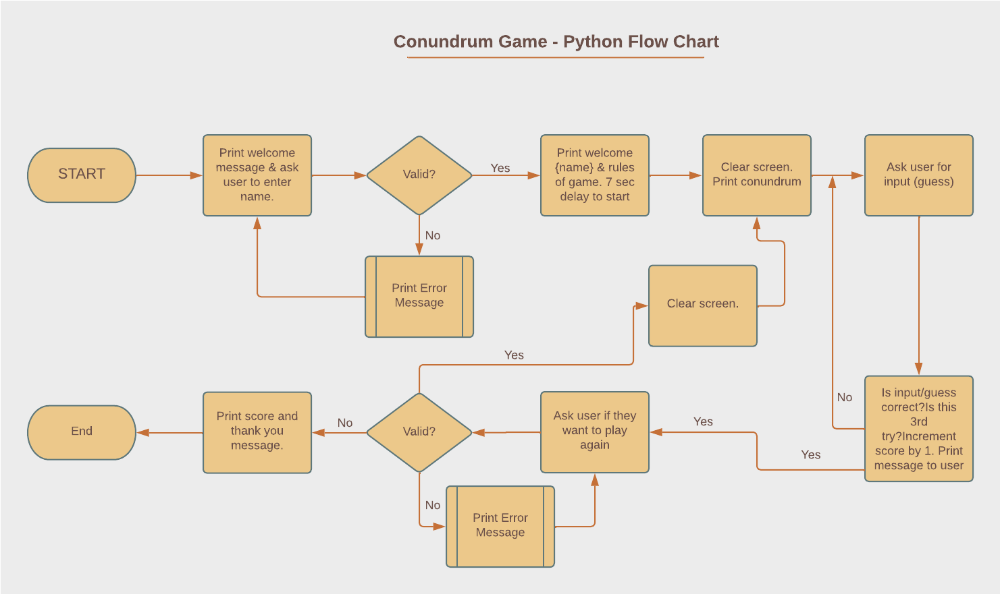
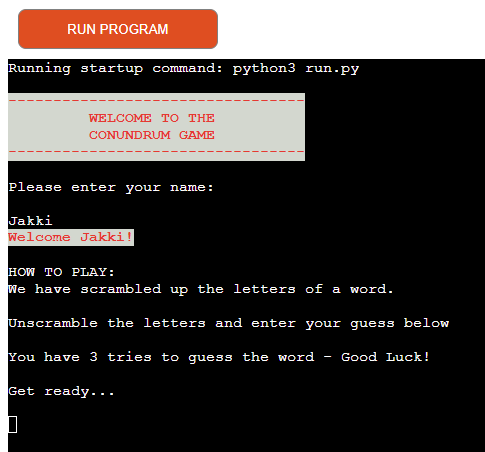
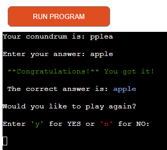
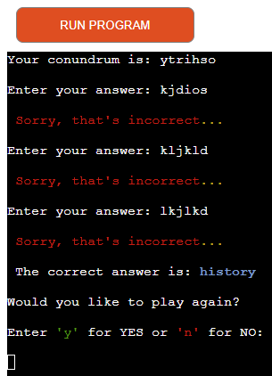
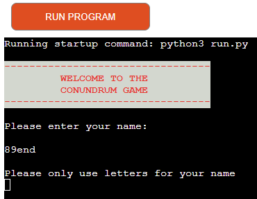

## Conundrum Game!
This game was created for the sole purpose of completing the third project for the Code Institues's Full Stack Developer Course. It was built using the knowledge gained from the Python course. It runs in the Code Institute mock terminal on Heroku. 
This is a fun game where the user has 3 tries to guess the conundrum. A score is given for every correct answer returned after the user has finished playing.

## How to play
Conundrum Game is a one player game. The computer generates a random word where all the letters have been scrambled into a different order.

The user has to guess the word by typing in thier guess.

If the guess is correct the user will see a message and will be asked if they would like to play again. For every correct guess you get 1 point.

If the user guesses incorrectly, they will be given 3 tries before the correct answer is revealed.

The live version of my project can be found [here] (https://conundrum-game.herokuapp.com/).

## Table of Contents
* [Flowchart](#Flowchart)
* [User Stories](#User-Stories)
* [Features](#Features)
    * [Existing Features](#Existing-Features)
    * [Future Features](#Features-Left-to-Implement)
* [Technologies](#Technologies)
    * [Languages and Libraries](#Languages-and-Libraries)
    * [Programs](#Programs)
* [Testing](#Testing)
    
* [Deployment](#Deployment)
    
* [Credits](#Credits)
 
***
## Flowchart

## User stories

    * As a visiting user I would like to be able to understand and play the game after reading the rules.
    * As a visiting user I would like to be able to choose to end the game or play again.
    * As a visiting user I would like to be able to see how many answers I got correct.
    
## Features

### Existing Features
#### Displays the game message and prompts the user to input the name
    * The game message clearly shows the user the name of the game and prompts to enter a name. 

#### Displays the welcome user and displays the rules of the game
    * The computer welcomes the user by name and displays the rules for 7 seconds. 
    

#### The Game Starts - Correct Answer
    
    * The computer clears the screen and displays the conundrum, user inputs an answer and if correct displays a message. User can then choose to play again or exit the game. On exit score is given.
    

#### The Game Starts - Incorrect Answer
    
    * The computer clears the screen and displays the conundrum, user inputs an answer and if incorrect displays a message. User can then have another go - they have three tries. If after three tries the user has not been successful, the computer will display the correct answer and ask if the user would like to play again or exit. On exit score is given.
    

#### Input validation and Error Checking
    
    * The computer will show a message to the user if the name input is incorrect and instruct the user of the correct input required.
    

#### The Game Ends - User Chooses To Exit Game
    
    * The computer will show a message to the user to say thank you for playing and display number of correct answers.
    

### Features Left to Implement
- Allow the user to choose the length of the word they want to unscramble
- 
***

### Technologies

#### Languages & Libraries

* HTML - generated from the python essential template built by Code Institute
* JavaScript - generated from the python essential template built by Code Institute
* Python - for building the game
* Python Libraries - the following libraries were used:
	- os - to eliminate previous code and clear the screen making it clutter freee and easier to read.
    - random - to randomise the choice of word.
    - time - for delaying the rules appearing and the start of the game after the rules are read.
### Programs
* GitHub - used to store the project
* Git - used for version control
* Heroku - used to deploy the app
* [Lucid Chart](https://lucid.app/lucidchart/18827059-8da4-4180-b067-a73ce2939e2e/edit?invitationId=inv_bea336d3-f7ab-4a83-99fb-8d2ad2755c00&page=rMoEJG9m52NN#) - used to create the flowchart for the project
* 
***
### Testing
Testing document can be found [here](testing.md)

### Deployment
The game was deployed on Heroku. The following steps were used to deploy the game to Heroku:

  * Sign into Heroku.
  * On the main dashboard choose to Create new app.
  * Choose a unique name for your project and the region, based on where you are located (as I'm in Europe, I chose Europe), and then click on Create app.
  * Then go to the Settings tab.
  * In Settings click on Reveal Config Vars and enter the following key: PORT and     
    value: 8000.    
  * Next scroll down to Buildpacks and click Add buildpack, choose Python and then click Save 
    changes.
  * Repeat the above step and select nodejs and click Save changes.
  * Next go to the Deploy tab.
  * Under the Deployment method, choose GitHub and then click Connect to GitHub you will probably be prompted to sign into your GitHub.
  * Then you can search for your GitHub repository, in my case this was conundrum-game and click connect.
  * To deploy automatically you will need to select Enable Automatic Deploys which will rebuild the app every time you push a change to GitHub.
  * To deploy manually go to the Manual deploy section below and click Deploy Branch. Just remember you will need to do this every time you make a change to your code on Github.
  * Below you will see your app was successfully deployed with a view button below this that will take you to the URL of your deployed app.

***
## Credits
### Code
The python code was learned from the Code Institute Full Stack Software Developer Course and by practising the Love Sanwiches project.
Syntax for the random and shuffle were assisted by my Mentor, Ronan McClelland.
Bug for the scoring was assisted by Code Institute Student Support - Rebecca.
Code Institue for the Python Linter.

### Content
The content of this software was created in full by Jakki Parker.
