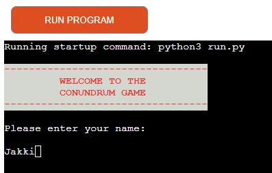
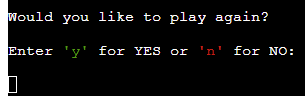

# TESTING

## Manual testing

### Features

Feature Tested | Expected Result | Actual Result | Pass/Fail
---------------|-----------------|--------------|--------------
Diplay game name and request input | Show game name and request name input from user| As expected | Pass
Type a name and press enter | User inputs name and receives a message "Welcome {name}!", wait 1 second then display the rules, wait 7 seconds then clear the screen and start the game.| As expected | Pass
Display conundrum | Show message "Your conundrum is:" and give jumbled word from the list | As expected | Pass
Display Input Message | Show message "Enter your answer:" and give option for input | As expected | Pass
Correct Answer Given | Show message "Congratulations - you got it! and show correct answer. Give option to exit or play again| As expected | Pass
Incorrect Answer Given| Show message "sorry that's incorrect" and repeat input request| As expected | Pass
Three Incorrect Answers | Show message "sorry that's incorrect", show correct answer give option to exit or play again| As expected | Pass 
Player chooses to play again | Input 'y' - screen clears, game restarts | As expected | Pass
Player chooses not to play again | Input 'n', the incremented score shows and a message "Thank you for playing!" | As expected | Pass

### Invalid input  

Input | Expected Result | Actual Result | Pass/Fail
-------------|-----------------|---------------|----------
Type something other than letters when asked for name | Receive a message "Please only use letters for your name!" | As expected | Pass
Type answer using uppercase| Receive a message "Please use all lowercase letters" | As expected | Pass
Type something other than y or n to exit or play again| Receive a message "Invalid Answer. Press y to restart or n to exit game" | As expected | Pass

## Bugs

Bug | Status | Fix  
----|--------|-----
Game does not check to see if all lowercase is used | Resolved | 

## Remaining Bugs

  * No bugs remaining.

## Validator Testing

* [CI Python Linter](https://pep8ci.herokuapp.com/)

I used Code Institute's Python Linter which confirmed that there are no errors. 

[PEP8CI](images/pep8ci.png)

## Testing User Stories

* As a visiting user I would like to be able to understand and play the game after reading the rules.
    * The user is playing alone. The rules of the game are displayed for seven seconds before the screen clears and the game starts.
   

* As a visiting user I would like to be able to choose to end the game or play again.
    * User should enter 'y' to play again the game or 'no' to exit the game.

    

* As a visiting user I would like to be able to see how many answers I got correct.
    * When the question to play again shows on the screen and if user enters no, the score should be displayed on the screen where the user can see how many conundrums they got correct.  
    
    